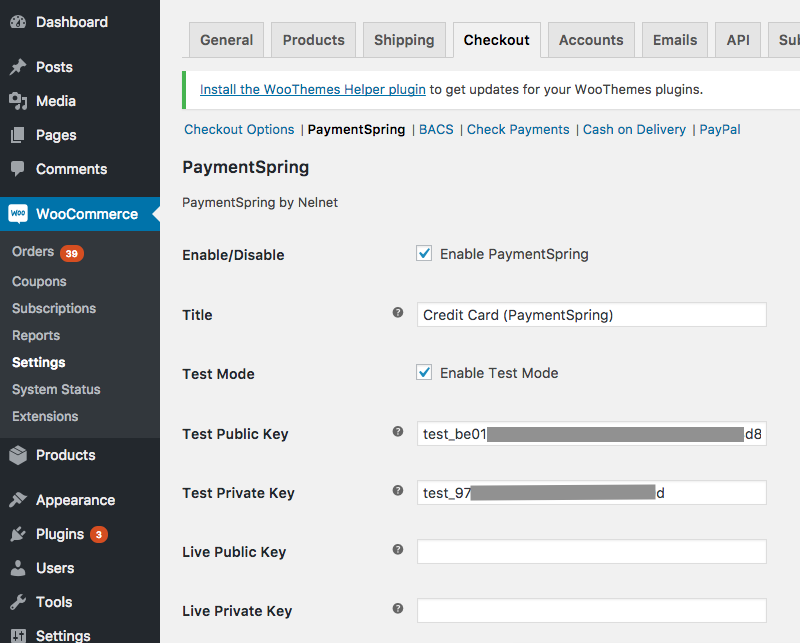

# PaymentSpring for WooCommerce

## Description

[PaymentSpring](https://www.paymentspring.com/) is a credit card processing gateway with a developer friendly API. This plugin is officially supported by PaymentSpring and is specifically designed for use with WooCommerce. 

PaymentSpring API keys are required.  You can obtain your own by [registering for a free PaymentSpring test account](https://www.paymentspring.com/signup). 

This plugin supports WooCommerce Subscriptions.

## Dependencies

* [WooCommerce](http://wordpress.org/plugins/woocommerce/) (Premium plugin, purchase is required)
* [WooCommerce Subscriptions](https://woocommerce.com/products/woocommerce-subscriptions/) (Required only if wanting to do subscriptions)
* WordPress 

Officially tested using WordPress 4.7.3, WooCommerce 2.6.14, WooCommerce Subscriptions 2.1.4

## Setup
 
1. Install WooCommerce
2. Install the PaymentSpring for WooCommerce Plugin
3. Add your API Keys (Select "WooCommerce" on the sidebar > "Settings" > "Checkout" > "PaymentSpring")

### Going Live
To go live, be sure to select "Live" from the mode options and enter in your live API keys.

